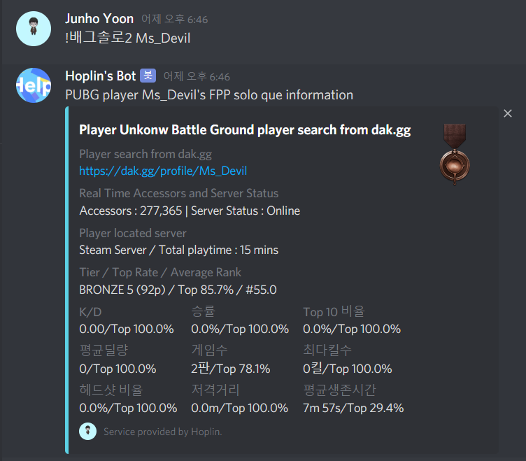
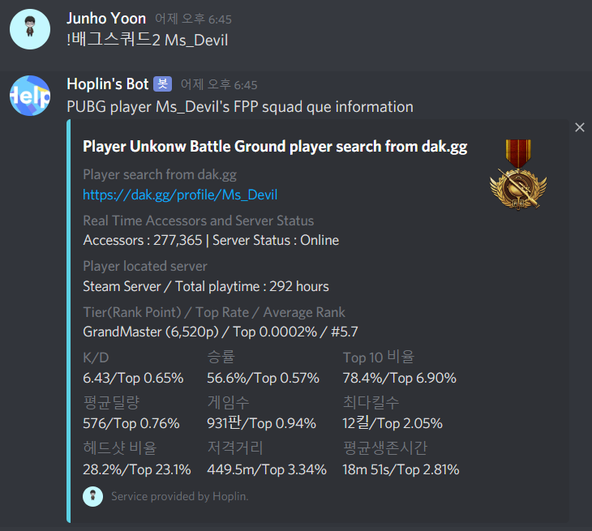
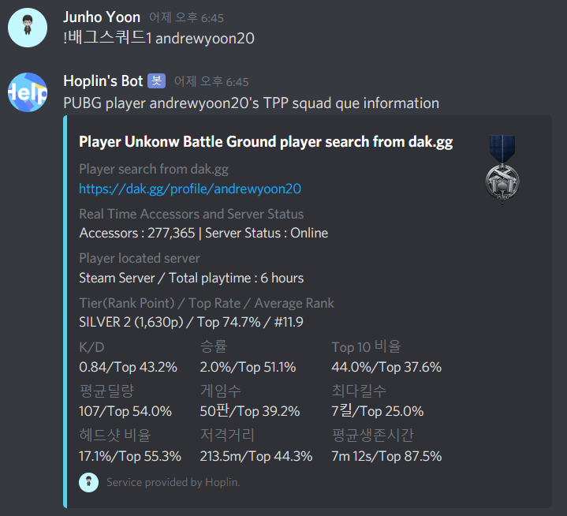
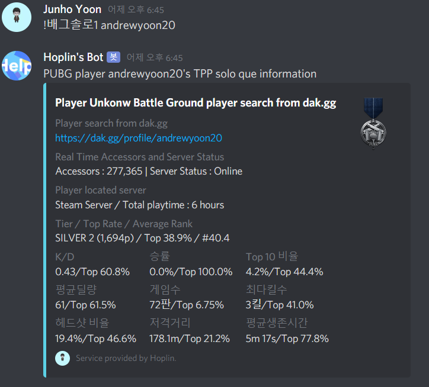
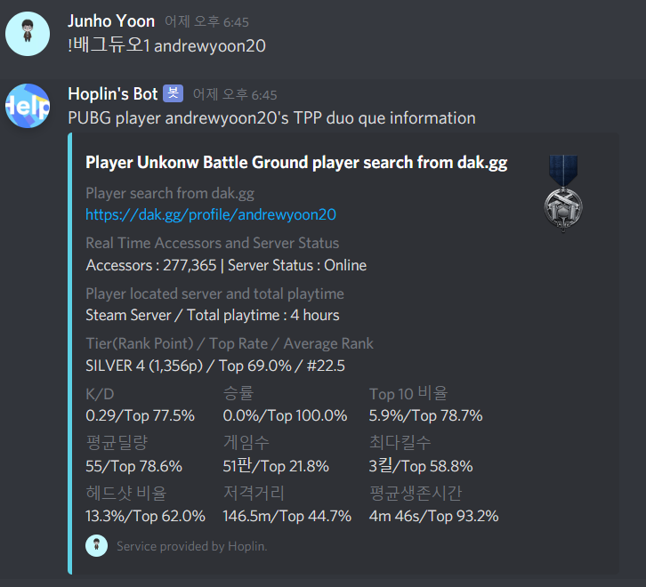

Discord Bot : Player Unknown Battle Ground Player information Search
===

**봇 소스코드를 가져가서 쓰시되, 출처를 꼭 밝히고 쓰시길 바랍니다** 
**오류 사항이나 추가하면 좋을것같은 기능들이 있으시다면 e-mail로 연락주셔도 Issues에 올려주시면 감사하겠습니다**

***
1 . Discord.py Version : 1.0.0(Rewrite Version)

2 . Language : Python3

3 . What for? : To make able to search player's own battle ground complete record more simply through command

4 . Support : All of the server(Kakao/Steam) are supported and you can search everywhere, regardless of the FPP TPP.
***
  - Patch Note 20200401
    
    - Bug Fix
    
  - Patch Note 20200624
  
    - Patch BackGround : https://github.com/J-hoplin1/PUBG-player-search-bot/commit/c3d0cbd9631d095ae110be5b995b1bc6cfec86a6
  
    - 경쟁전 전적검색 기능 업데이트. 
    
    - 다음패치는 리팩토링 작업과 경쟁전 전적검색 안정화 작업을 할 예정입니다. 현재 변경된 웹 구조를 대응한 상태이지만, 사용하면서 오류가 있으시다면 바로 Issues에 올려주시면 감사하겠습니다.
***
  - !배그솔로1 : Search player's solo que(TPP)
  
  - !배그솔로2 : Search player's solo que(FPP)
  
  - !배그듀오1 : Search player's duo que(TPP)
  
  - !배그듀오2 : Search player's duo que(FPP)
  
  - !배그스쿼드1 : Search player's squad que(TPP)
  
  - !배그스쿼드2 : Search player's squad que(FPP)
  
   
    
   
   
   
   
   
   
   
